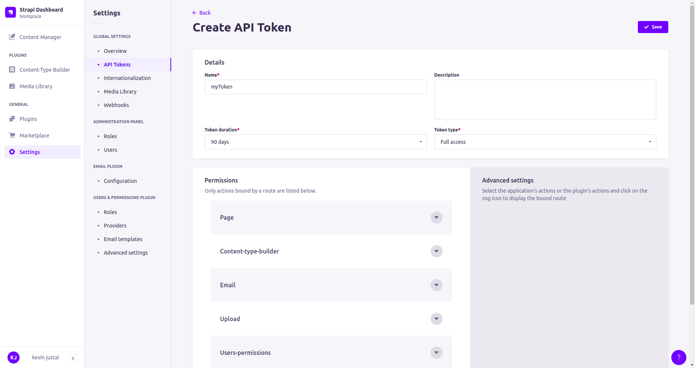

# LABORATORY-STRAPI

This laboratory is about [Strapi](https://strapi.io/). A CMS open-source for managing the content of a website through a portal. In the past, I have to work with another CMS called [Hygraph](https://hygraph.com/). Even if it was perfect at the beginning, once the website reach a certain point, the number of queries made to it was too high. Because of this, we got block by the rate limiter of hygraph. They has certainly put that in place for protecting themself against DDOS attack but for our particular case, it was a blocker.

Looking around, Strapi seems to be the perfect solution. Since it can be self-hosted, it appears to be the perfect replacement for Hygraph. Before any change, I always tried everything on my own and this repository is my experimentation with the tool.

## Plan of the presentation

I explain with all the details how I build the project and my way of working.

- [Experiences](#experiences)
- [Running](#running)
- [System](#system)

## Experiences

#### Creating an account


#### Creating a collection


For creating a model, like hygraph, simply click on the `Content-type Builder` and follow the interface. It's actually easier than hygraph on this point.


#### Creating content

Once done, by clicking on `Content Manager`, we can fill up our conent


#### Creating an api token and querying the api



For testing purpose, I use Postman to query the content I did using a GET call


## Limitations

- Strangely, we cannot add more than 3 roles. I am sure it will be possible to bypass this protection by looking at the code.


## Running

```bash
$ npm run start
```

## System

Ubuntu Version: Ubuntu 20.04.1 LTS
Node Version: v16.15.1

```bash
# Get the version of node
$ node -v

# Get the latest version of ubuntu
$ lsb_release -a
```